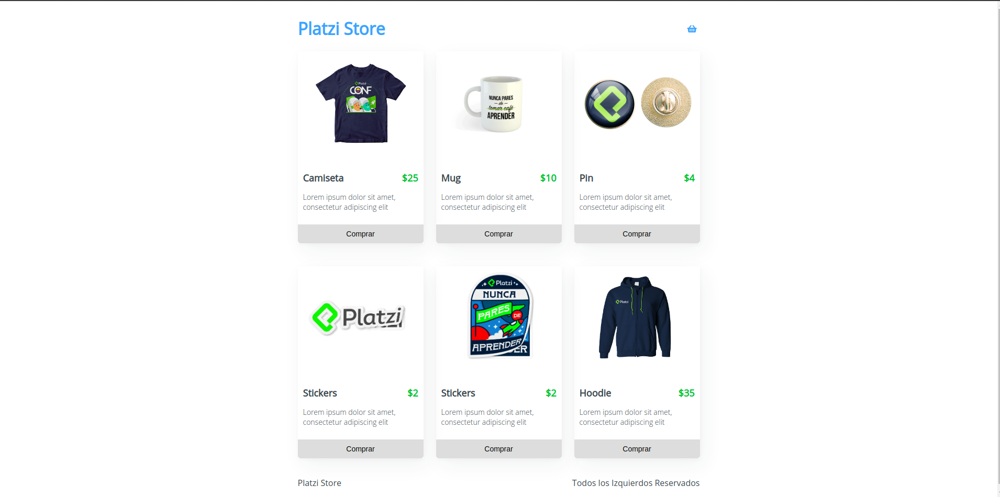
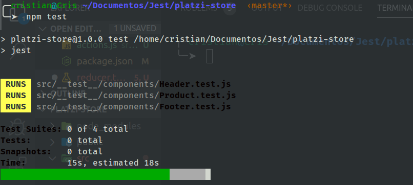
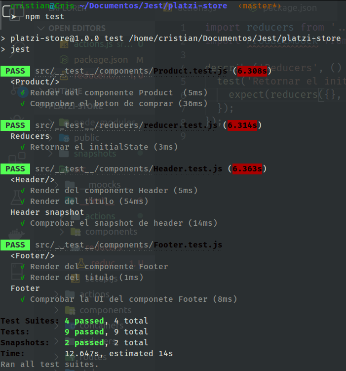
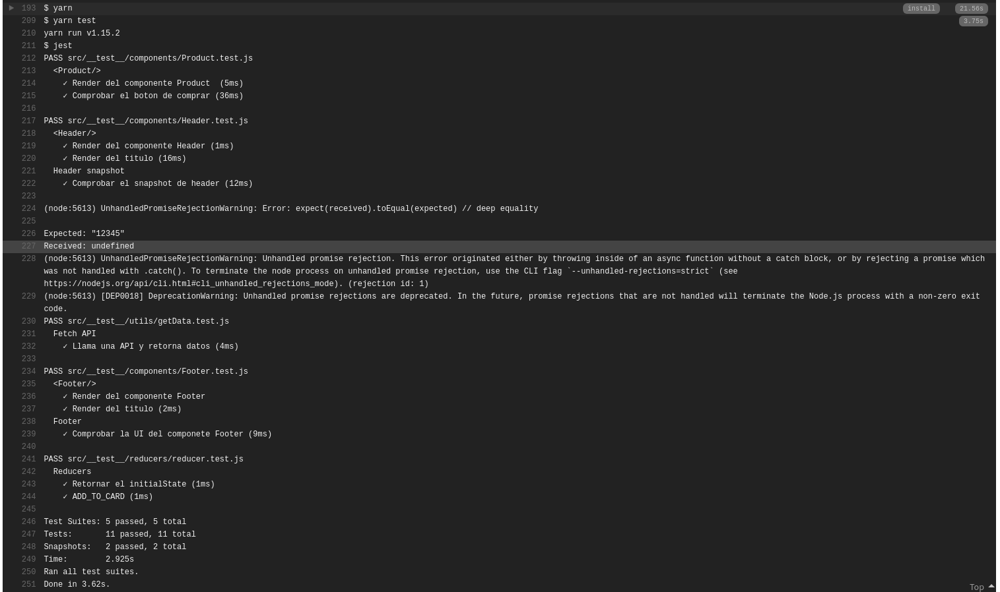

# Curso de Jest con Platzi

Curso de Pruebas unitarias con Jest

## ¿Qué contiene el proyecto?

1. Aplicación con React, React Route, Redux
2. Unit test con Jest. Aquí el [link](https://crisronda.github.io/Jest/ 'Visita la web')

### Para correr la aplicación

- `yarn add install`

### Para correr las pruebas

- `npm run test`

#### Screenshots

Aplicación React

  

Pruebas con Jest

  

  

Continuous Deploy en Travis

  

